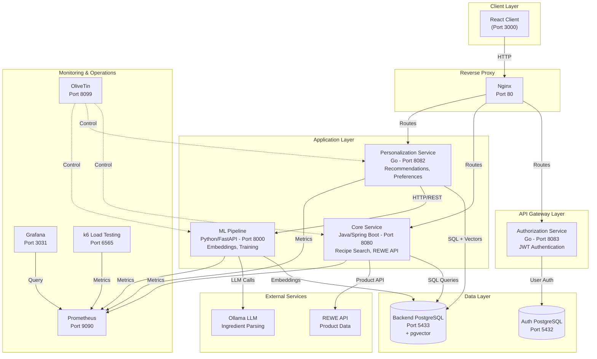

# Decidish

**Your Personal Recipe Companion Powered by AI**

Decidish is a modern, AI-powered recipe recommendation platform that delivers personalized culinary experiences. Using machine learning, vector embeddings, and real-time preference learning, Decidish helps users discover recipes tailored to their dietary needs, cooking skills, and taste preferences.

This repository contains the complete **microservices-based application**, fully containerized using **Docker Compose**. The architecture integrates multiple languages (**Java, Go, Python, React**) with a robust data layer (**PostgreSQL with pgvector**).

---

## Key Features

- **Personalized Recommendations**: AI-powered recipe suggestions based on user preferences and behavior
- **Real-Time Learning**: User embeddings adapt instantly to likes and dislikes
- **Smart Shopping Lists**: Generate shopping lists with real-time product matching from REWE
- **Advanced Search**: Multi-filter recipe search (categories, keywords, time, calories, allergens)
- **Save & Organize**: Save favorite recipes and manage shopping history
- **Multi-Language Support**: Internationalization with i18next
- **Vector Embeddings**: 384-dimensional semantic recipe and user embeddings
- **Market Integration**: Postal code-based market selection with product availability
- **Responsive Design**: Modern React frontend with Tailwind CSS

---

## Prerequisites

- **Docker** v20.10+ (Desktop or Engine)
- **Docker Compose** v2.0+ (recommended)
- **Git** (for cloning the repository)
- **4GB+ RAM** available for Docker
- **10GB+ disk space** for images and volumes

---

## Quick Start

### 1. Clone the Repository

```bash
git clone <repository-url>
cd decidish
```

### 2. Configure Environment

Create a `.env` file from the example:

```bash
cp .env.example .env
```

Edit `.env` with your configuration:

```bash
# Database Configuration
POSTGRES_USER=user
POSTGRES_PASSWORD=your_secure_password
POSTGRES_DB=decidish

# JWT Secret (use same across all services)
JWT_SECRET=your_jwt_secret_key_here

# ML Pipeline
EMBEDDER_SERVER_URL=http://mlpipeline:8000

### 3. Start All Services

```bash
# Build and start all services in detached mode
docker compose up --build -d
```

Initial build takes 5-10 minutes. Subsequent starts are faster.

### 4. Verify Services

Check that all services are running:

```bash
docker compose ps
```

Expected output: All services should show `Up` status.

### 5. Access the Application

- **Frontend**: http://localhost:8081
- **Core API**: http://localhost:8080
- **Personalization API**: http://localhost:8082
- **Authorization API**: http://localhost:8083
- **ML Pipeline API**: http://localhost:8000

### 6. Run Database Migrations

```bash
docker compose up migrations
```

### 7. Stop Services

```bash
# Stop services (keeps data)
docker compose stop

# Stop and remove containers (keeps volumes)
docker compose down

# Stop and remove everything including volumes (clean slate)
docker compose down -v
```

---

## System Architecture

Decidish follows a **microservices architecture** with clear service boundaries, independent scaling, and technology diversity. Each service is containerized and communicates via HTTP REST APIs and event streaming.

### Architecture Diagram



### Service Communication Patterns

- **Sync/Async HTTP/REST**: Client ↔ Services, Service ↔ Service
- **Reverse Proxy**: Nginx routes requests to backend services
- **Database**: Shared PostgreSQL with schema boundaries
- **Authentication**: JWT tokens validated across services
- **Monitoring**: Prometheus metrics collection, Grafana dashboards

---

## Service Documentation

Each service has comprehensive documentation covering architecture, APIs, and deployment:

- **[Client (React)](client/README.md)** - Frontend application with React 19, TypeScript, Vite
- **[Authorization Service (Go)](backend/authorization/README.md)** - JWT authentication and user management
- **[Core Service (Java/Spring)](backend/core/README.md)** - Recipe search, REWE integration, product matching
- **[Personalization Service (Go)](backend/personalization/README.md)** - Recommendations, user preferences, shopping lists
- **[ML Pipeline (Python)](mlpipeline/README.md)** - Embeddings, training, ingredient parsing

---

## Services Overview

The system is divided into logical tiers: **Client**, **Application**, **Data**, and **Messaging**.

### 1. Client Layer

| Service | Container Name | Technology | Port | Documentation | Description |
| :--- | :--- | :--- | :--- | :--- | :--- |
| **Client** | `dev_client` | React 19 + TypeScript + Vite | `3000` | [Docs](client/README.md) | Modern frontend with TailwindCSS, React Router, i18next. Tinder-style recipe swiper, shopping lists, search. |
| **Nginx** | `nginx` | Nginx Alpine | `80` | - | Reverse proxy for routing HTTP requests to backend services. |

### 2. Application Layer

| Service | Container Name | Technology | Port | Documentation | Description |
| :--- | :--- | :--- | :--- | :--- | :--- |
| **Authorization** | `dev_authorization` | Go 1.25 + Gin | `8083` | [Docs](backend/authorization/README.md) | JWT authentication, user registration/login, HTTP-only cookies, bcrypt password hashing. |
| **Core** | `dev_core` | Java 21 + Spring Boot 3.5 | `8080` | [Docs](backend/core/README.md) | Recipe search, REWE API integration, fuzzy ingredient matching, shopping list generation. |
| **Personalization** | `dev_personalization` | Go 1.25 + Gin | `8082` | [Docs](backend/personalization/README.md) | Personalized recommendations, user preferences, shopping lists, saved recipes, vector similarity search. |
| **ML Pipeline** | `dev_mlpipeline` | Python 3.12 + FastAPI | `8000` | [Docs](mlpipeline/README.md) | Recipe embeddings (SentenceTransformers), user encoder, online learning, ingredient parsing (Ollama), weekly adapter training. |

### 3. Data Layer

| Service | Container Name | Technology | Port | Volume | Description |
| :--- | :--- | :--- | :--- | :--- | :--- |
| **Backend DB** | `dev_backend_postgres` | PostgreSQL 16 + pgvector | `5433` | `db_backend_data` | Stores recipes, user preferences, embeddings (384-dim vectors), shopping lists, jobs. |
| **Auth DB** | `dev_auth_postgres` | PostgreSQL 16 Alpine | `5432` | `db_authorisation_data` | Stores user accounts, password hashes, JWT refresh tokens. |

### 4. Monitoring & Operations

| Service | Container Name | Technology | Port | Volume | Description |
| :--- | :--- | :--- | :--- | :--- | :--- |
| **Prometheus** | `prometheus` | Prometheus Latest | `9090` | `prometheus_data` | Metrics collection and time-series database. Scrapes metrics from services. |
| **Grafana** | `grafana` | Grafana Latest | `3031` | - | Observability dashboards for metrics visualization. Pre-configured dashboards included. |
| **OliveTin** | `olivetin` | OliveTin Latest | `8099` | - | Web UI for running maintenance scripts and operations (cron jobs, sync, cleanup). |
| **k6** | `k6` | Grafana k6 Latest | `6565` | - | Load testing tool for performance benchmarking and stress testing. |

---

## Accessing Services

### From Host Machine (Development)

Access services via `localhost` with mapped ports:

| Service | URL | Credentials |
| :--- | :--- | :--- |
| **Frontend** | http://localhost:3000 | - |
| **Nginx (Reverse Proxy)** | http://localhost:80 | - |
| **Core API** | http://localhost:8080 | - |
| **Core API Docs** | http://localhost:8080/swagger-ui.html | - |
| **Authorization API** | http://localhost:8083 | - |
| **Personalization API** | http://localhost:8082 | - |
| **ML Pipeline API** | http://localhost:8000 | - |
| **ML API Docs** | http://localhost:8000/docs | - |
| **Prometheus** | http://localhost:9090 | - |
| **Grafana** | http://localhost:3031 | admin/secret |
| **OliveTin** | http://localhost:8099 | - |
| **Backend Database** | `localhost:5433` | user: `user`, pass: `.env` |
| **Auth Database** | `localhost:5432` | user: `user`, pass: `.env` |

### Service-to-Service Communication

All services communicate internally via the `app-network` Docker network. Services reference each other by **service name** defined in `docker-compose.yml`:

**Internal Service Names**:
- `db_backend` - Backend PostgreSQL
- `db_authorisation` - Auth PostgreSQL  
- `nginx` - Reverse proxy
- `core-server` - Core service
- `personalization-server` - Personalization service
- `authorization-server` - Authorization service
- `mlpipeline` - ML Pipeline
- `prometheus` - Metrics collection
- `grafana` - Dashboards
- `olivetin` - Operations UI
- `k6` - Load testing

**Example**: Personalization service calls ML Pipeline:
```go
url := "http://mlpipeline:8000/encode_users_batch"
resp, err := http.Post(url, "application/json", body)
```

---

## Volume Mapping & Data Persistence

### Development Volume Mounts

For **hot-reloading** and live development, source code is mounted directly:

| Host Directory | Container Path | Service | Hot Reload |
| :--- | :--- | :--- | :--- |
| `./client` | `/app` | Client | Yes (Vite HMR) |
| `./backend/authorization` | `/app` | Authorization | Yes (go run) |
| `./backend/core` | `/app` | Core | Yes (Spring DevTools) |
| `./backend/personalization` | `/app` | Personalization | Yes (go run) |
| `./mlpipeline` | `/app` | ML Pipeline | Yes (uvicorn reload) |

### Data Persistence Volumes

Data persists across container restarts via Docker named volumes:

| Volume Name | Stores | Size (Approx) | Backup Required |
| :--- | :--- | :--- | :--- |
| `db_backend_data` | Recipes, embeddings, user data | 5-50 GB | Yes |
| `db_authorisation_data` | User accounts, passwords | 1-5 GB | Yes |
| `prometheus_data` | Metrics time-series data | 1-5 GB | No |

**Backup Command**:
```bash
# Backup backend database
docker compose exec db_backend pg_dump -U user decidish > backup_$(date +%Y%m%d).sql

# Restore from backup
cat backup_20260201.sql | docker compose exec -T db_backend psql -U user decidish
```

---

## Development Workflow

### Making Code Changes

1. **Edit code** in your local IDE (VS Code, IntelliJ, etc.)
2. **Changes auto-reload** in containers (no restart needed)
3. **View logs** to verify changes:
   ```bash
   docker compose logs -f <service-name>
   ```

### Restarting Individual Services

```bash
# Restart specific service
docker compose restart personalization

# Rebuild and restart after dependency changes
docker compose up -d --build personalization

# View service logs
docker compose logs -f personalization
```

### Running Tests

```bash
# Backend Core (Java)
docker compose exec core-server ./gradlew test

# Personalization (Go)
docker compose exec personalization go test ./...

# ML Pipeline (Python)
docker compose exec mlpipeline uv run pytest

# Client (React)
docker compose exec client npm test
```

### Database Migrations

```bash
# Run migrations (Flyway for Core)
docker compose exec core-server ./gradlew flywayMigrate

# Check migration status
docker compose exec core-server ./gradlew flywayInfo

# Access database directly
docker compose exec db_backend psql -U user decidish
```

---

## Technology Stack

### Frontend
- **React 19** - UI framework
- **TypeScript 5.8** - Type safety
- **Vite 7** - Build tool & dev server
- **TailwindCSS 3.4** - Utility-first CSS
- **React Router 7.6** - Client-side routing
- **Axios** - HTTP client
- **i18next** - Internationalization

### Backend Services
- **Java 21** - Core service (Spring Boot 3.5)
- **Go 1.25** - Authorization & Personalization (Gin framework)
- **Python 3.12** - ML Pipeline (FastAPI)

### Data & Cache
- **PostgreSQL 16** - Primary database
- **pgvector** - Vector similarity search

### Machine Learning
- **PyTorch 2.9** - Deep learning framework
- **Sentence Transformers** - Text embeddings
- **Ollama** - Local LLM inference
- **UV** - Fast Python package manager

### DevOps & Monitoring
- **Docker & Docker Compose** - Containerization
- **Nginx** - Reverse proxy and load balancing
- **Prometheus** - Metrics collection
- **Grafana** - Observability dashboards
- **OliveTin** - Operations and cron job management
- **k6** - Load testing and performance benchmarking

---

## Troubleshooting

### Container Fails to Start

Check logs for the specific service:
```bash
docker compose logs -f <service_name>
# Example: docker compose logs -f core-server
```

**Common issues**:
- Port already in use: Change port mapping in `docker-compose.yml`
- Out of memory: Increase Docker memory limit (Docker Desktop settings)
- Build failures: Clear Docker cache and rebuild

### Clean Slate Reset

**Nuclear option** - removes all data:
```bash
# Stop everything
docker compose down -v

# Clean system
docker system prune -a --volumes

# Rebuild from scratch
docker compose up --build
```

---

## Contributing

We welcome contributions! Please:

1. **Fork** the repository
2. **Create** a feature branch: `git checkout -b feature/my-feature`
3. **Make** your changes with clear commit messages
4. **Test** your changes locally
5. **Submit** a pull request

---

## License

[Specify License Here]

---

**Last Updated**: February 1, 2026  
**Version**: 1.0.0
