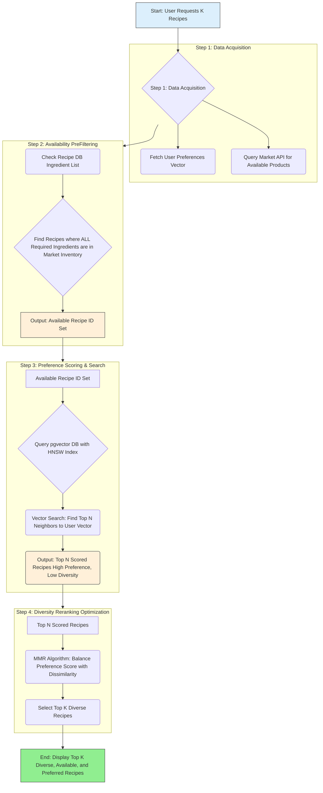

```mermaid
graph TD
    A[Start: User Requests K Recipes] --> B{Step 1: Data Acquisition};

    subgraph Step 1: Data Acquisition
        B --> B1(Fetch User Preferences Vector);
        B --> B2(Query Market API for Available Products);
    end

    B --> C(Step 2: Availability PreFiltering Hard Constraint);
    
    subgraph C[Step 2: Availability PreFiltering]
        C1(Check Recipe DB Ingredient List) --> C2{Find Recipes where ALL Required Ingredients are in Market Inventory};
        C2 --> C3[Output: Available Recipe ID Set];
    end

    C3 --> D(Step 3: Preference Scoring & Search Soft Constraint);
    
    subgraph D[Step 3: Preference Scoring & Search]
        D1[Available Recipe ID Set] --> D2{Query pgvector DB with HNSW Index};
        D2 --> D3(Vector Search: Find Top N Neighbors to User Vector);
        D3 --> D4(Output: Top N Scored Recipes High Preference, Low Diversity);
    end

    D4 --> E[Step 4: Diversity Reranking Optimization];
    
    subgraph E[Step 4: Diversity Reranking Optimization]
        E1[Top N Scored Recipes] --> E2(MMR Algorithm: Balance Preference Score with Dissimilarity);
        E2 --> E3(Select Top K Diverse Recipes);
    end

    E3 --> F[End: Display Top K Diverse, Available, and Preferred Recipes];

    style A fill:#DCEFFC,stroke:#333
    style F fill:#90EE90,stroke:#333
    style C3 fill:#FFF0D9,stroke:#333
    style D4 fill:#FFF0D9,stroke:#333
```
