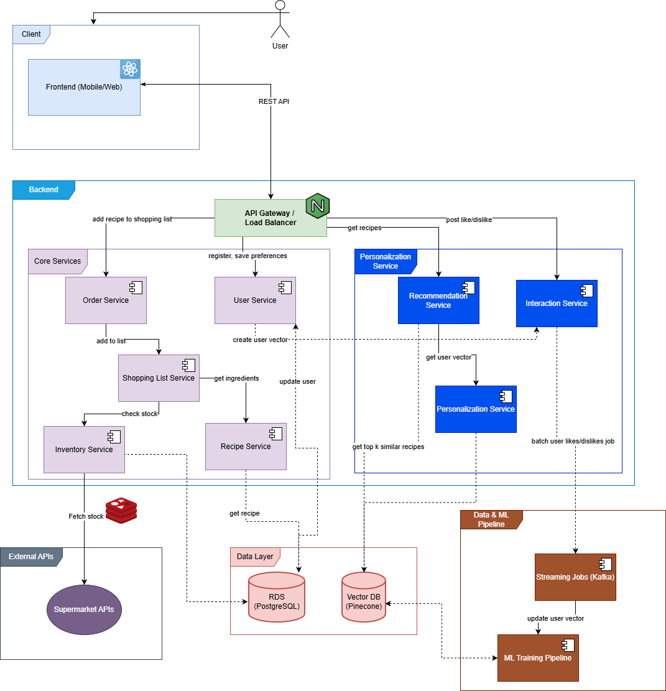

## System Architecture

TODO: Add explenation to the services

---

## 5. Technology Stack

### 1. Frontend
* **Framework:** React Native (for iOS, Android, and Web/Desktop)
* **Language:** TypeScript
* **API Comms:** REST API (Initial MVP).
    * *Note: Consider GraphQL if request amplification becomes an issue, but it is likely too complex for the MVP.*

### 2. Reverse Proxy / API Gateway
* **Tool:** Nginx
* **Responsibilities:** Load Balancing, API Gateway.

### 3. Retrieval Server
* **Language Candidates:**
    1.  Go
    2.  TypeScript (Node.js)
    3.  C#
    4.  Java
    5.  Kotlin

### 4. Recipe Server
* **Language Candidates:** Rust (TBD)

### 5. Database Layer
* **Primary DB:** AWS RDS (e.g., PostgreSQL)
* **Vector DB:** e.g., Prisma

### 6. Training / ML Pipeline
* **Purpose:**
    * Update the vector database.
    * Retrieve jobs from a Kafka streaming pipeline.
* **Stack:** Python (PyTorch, Scikit-learn, etc.)
* **Messaging:** Kafka

---

## Project Scope

### 1. Functional Requirements (FR)
* **FR1:** The system shall suggest suitable recipes based on the user's available ingredients.
* **FR2:** The system shall retrieve available products from local markets.
* **FR3:** The system shall generate personalized recipe recommendations.
* **FR4:** The system shall find nearest markets (based on user location).
* **FR5:** The system shall generate a shopping list (with specific ingredients from supermarkets) based on the user's chosen recipes.
* **FR6:** The system shall store user features, preferences, and profile information.
* **FR7:** The system shall track and store the user's recipe history (e.g., liked/disliked meals).

### 2. Non-Functional Requirements (NFR)

* **NFR1: Usability**
    * A user must be able to generate a shopping list within 5 clicks from the main dashboard.
* **NFR2: Robustness**
    * *[To be defined - e.g., error handling, fault tolerance]*
* **NFR3: Performance**
    * **Scalability:** The system must support 1 million concurrent users.
    * **Storage:** The system must handle an average of 50 MB of data per user.
    * **Transaction Speed:** 95% of transactions must be completed in under 1 second.
    * **Response Time:** P95 (95th percentile) response time should be under 100 ms per user request.
* **NFR4: Availability**
    * The system shall be available 95% of the time (uptime).
* **NFR5: Portability**
    * The application must be deployable on Android, iOS, and modern Web browsers.